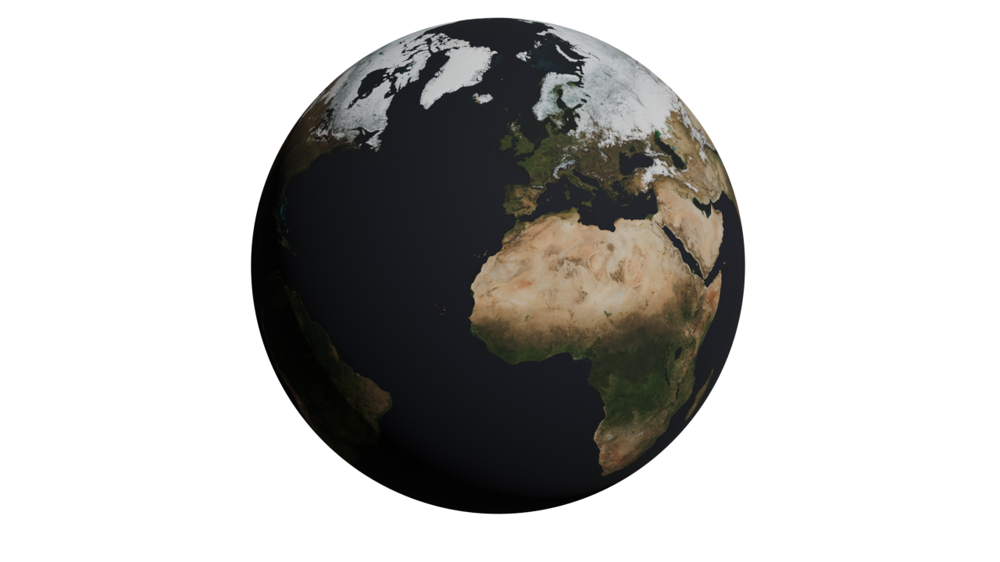

# Landlosen


[Texture image](https://visibleearth.nasa.gov/images/74518/december-blue-marble-next-generation-w-topography/74520l): _Reto Stöckli, NASA Earth Observatory_  
[Normal map image](https://visibleearth.nasa.gov/images/73934/topography/84331l): _Imagery by Jesse Allen, NASA's Earth Observatory, using data from the General Bathymetric Chart of the Oceans (GEBCO) produced by the British Oceanographic Data Centre_  

## What is this
___Landlosen_ is a solution to the assignment for candidates for internship at [SmartGIS](https://smartgis.no).__

It is not meant to be used as a stable source of information, but to be used as a basis for a technical interview for applicants to a job position.

## What does Landlosen mean?

_Landlosen_ is Norwegian and is put together from two words, "land" and "los". "Land" means both country and land, and "los" means guide or navigator. Landlosen can be translated to "country guide", which is what this service does through the RestCountries API.

## Table of Contents
<!-- TOC -->
* [Landlosen](#landlosen)
  * [What is this](#what-is-this)
  * [What does Landlosen mean?](#what-does-landlosen-mean)
  * [Table of Contents](#table-of-contents)
  * [Task description](#task-description)
  * [How to run](#how-to-run)
    * [Manually](#manually)
    * [Using the provided `.bat`-file](#using-the-provided-bat-file)
  * [Extra features](#extra-features)
  * [Notes](#notes)
<!-- TOC -->

## Task description
> This is not provided here, due to it being a time-limited task which is likely the same as other interviewees get. Therefore it is withheld by me.


## How to run

### Manually
1. First do:
    ```terminal
    gh clone repo
    ```
2. Then do:
    ```terminal
    npm run dev
    ```
### Using the provided `.bat`-file

1. Instructions
2. Instructions
3. Instructions

## Extra features
- Søke etter land i søkeboks
- Velge språk; norsk eller engelsk
  - RestCountries inkluderer ikke norske oversettelser i sine endpoints, så det som `GET`-es er på engelsk. Det tilbys likevel noen lokale oversettelser i dette prosjektet, men denne listen er ikke endelig. Litauen blir for eksempel Litauen, mens Elfenbenskysten forblir Ivory Coast... 
- RestCountries har ikke translation for norske egennavn på land, dette finnes i `countries.ts`.
- Velge temamodus; systemmodus, mørk modus eller lys modus
- Custom scrollbar (kun i WebKit-baserte nettlesere, Gecko-baserte nettlesere reverter til default og har få tilpasningsmuligheter uansett)

## Notes
> This is running locally, from your machine, but reading data from [RestCountries](https://restcountries.com). That means if that site is down, which is likely due to their [capacity worries](https://restcountries.com/#donations), you won't be able to get any results, and just browse a "shell" without any content.
- Det er en del blanding av norsk og engelsk. 

- Flowbite component library var ikke så greit å jobbe med, derfor er det skrevet egne løsninger innimellom for større detaljkontroll...