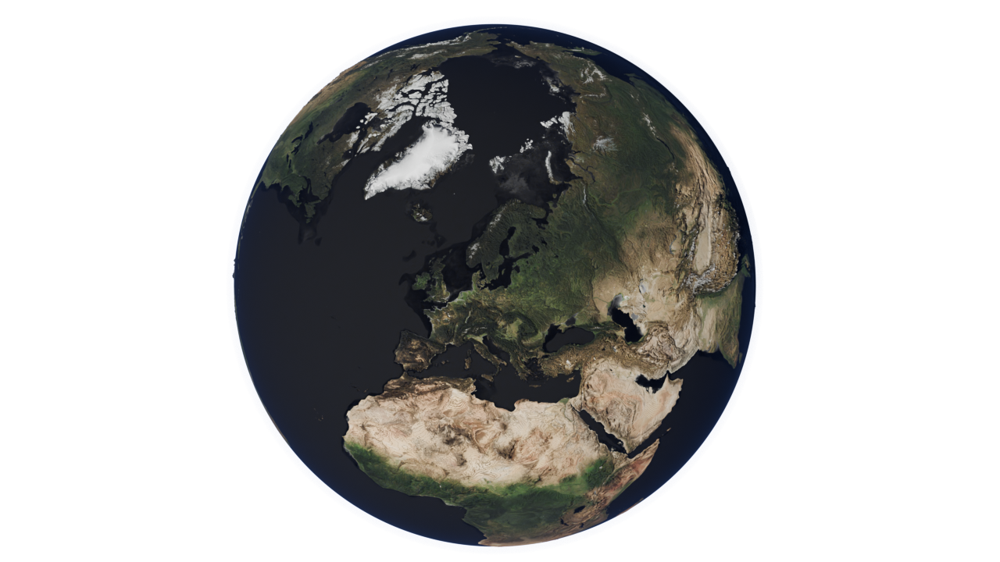
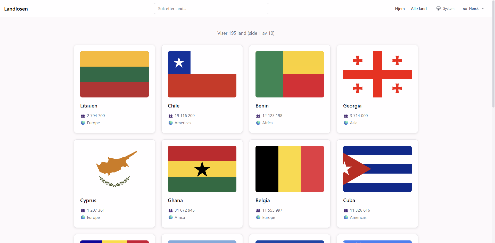
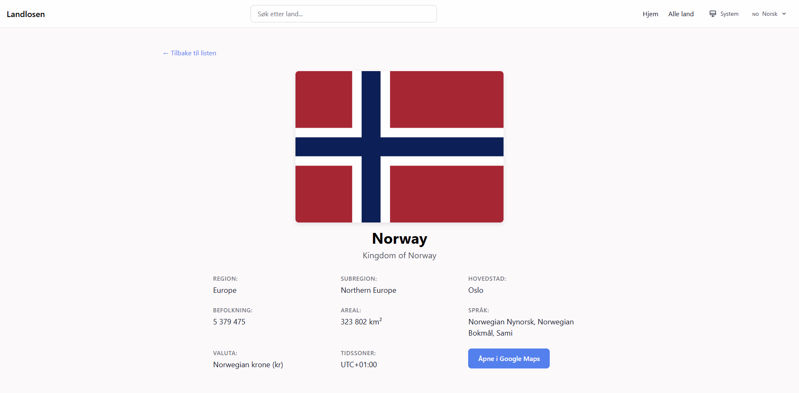
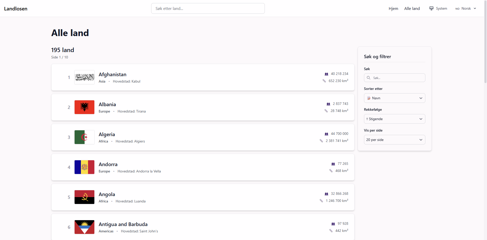
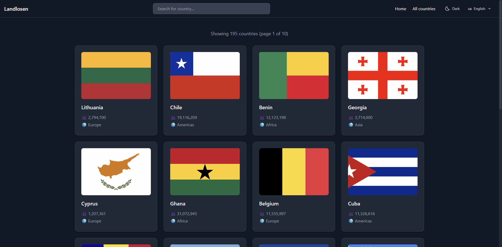
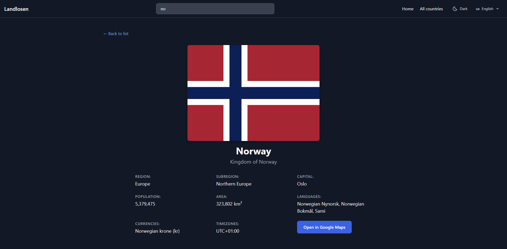
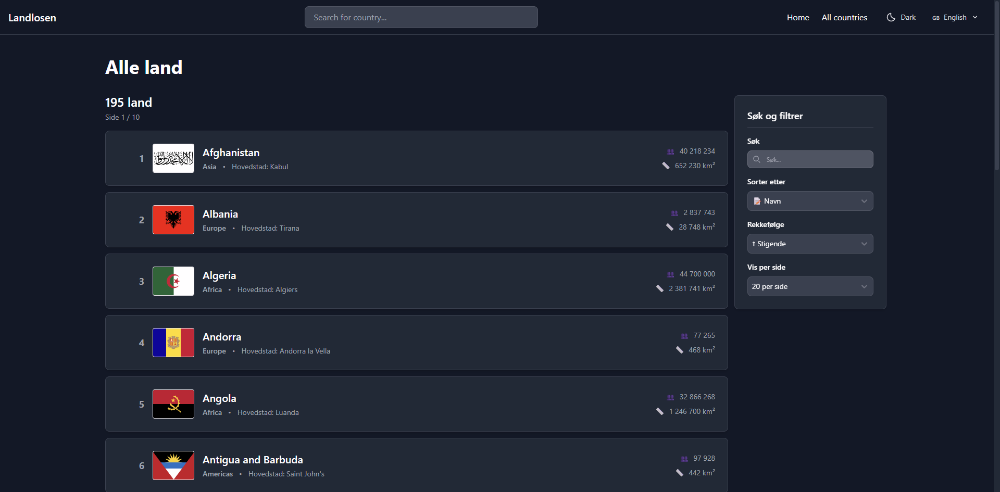

# Landlosen



__Image credits__:  
[Texture image](https://visibleearth.nasa.gov/images/74518/december-blue-marble-next-generation-w-topography/74520l): _Reto Stöckli, NASA Earth Observatory_  
[Normal map image](https://visibleearth.nasa.gov/images/73934/topography/84331l): _Imagery by Jesse Allen, NASA's Earth Observatory, using data from the General Bathymetric Chart of the Oceans (GEBCO) produced by the British Oceanographic Data Centre_  

## What is this
___Landlosen_ is a solution to the assignment for candidates for internship at [SmartGIS](https://smartgis.no).__

It is not meant to be used as a stable source of information, but to be used as a basis for a technical interview for applicants to a job position. It is a simple application to send GET requests about country information from the RestCountries API, with a focus on the front-end.

## What does Landlosen mean?

_Landlosen_ is Norwegian and is put together from two words, "land" and "los". "Land" means both country and land, and "los" means guide or navigator. Landlosen can be translated to "country guide", which is what this service does through the RestCountries API.

## Table of Contents
<!-- TOC -->
* [Landlosen](#landlosen)
          * [Image credits:](#image-credits-)
  * [What is this](#what-is-this)
  * [What does Landlosen mean?](#what-does-landlosen-mean)
  * [Table of Contents](#table-of-contents)
  * [Task description](#task-description)
  * [How to run](#how-to-run)
    * [Manually](#manually)
    * [Using the provided `.bat`-file](#using-the-provided-bat-file)
  * [Extra features](#extra-features)
  * [Notes](#notes)
  * [Screenshots](#screenshots)
<!-- TOC -->

## Task description
> This is not provided here, due to it being a time-limited task which is likely the same as other interviewees get. Therefore it is withheld by me.
[!NOTE] The interview rounds are now over, so I'll share it _a little_. Basically there were no instructions for the visual part, only functional requirements such as programmatic page numbering and being able to get a list of all countries, and view information about a specific country. So we had total freedom in terms of the visual stuff. I asked about this in the follow-up interviews, and they said it was to see how we think. 


## How to run

### Manually
1. From your wanted folder to run it from, open a terminal and enter:
    ```terminal
    git clone https://github.com/Scandiking/Landlosen
    ```
2. Then unzip the folder to wanted location.

3. `cd` to that location. Example:
    ```terminal
   cd C:/Users/YourName/ThisDownload
    ```
   
4. If the terminal now says something like
    ```terminal
    C:/Users/YourName/ThisDownload>
    ```

5. Then you can write
    ```terminal
   npm run dev
    ```
6. And now it should open in your standard browser.

If you are not used to using the terminal, you can do it the point-and-click-way:
### Using the provided `.bat`-file
1. Download the `.zip` directly from [here](https://github.com/Scandiking/Landlosen/archive/refs/heads/master.zip) or click the green Code-button on [this page](https://github.com/Scandiking/Landlosen#) and click `Download ZIP` in the dropdown menu.
2. Download and unzip it to wanted location.
2. Double-click the `RUN_ME.bat` file.

## Extra features
- Search for countries in search box
- Select language: Norwegian or English
  - Language changes load dynamically without page refresh
  - RestCountries API returns country names in English only. This project includes some local Norwegian translations, but coverage is incomplete. For example: Lithuania translates to "Litauen", but Elfenbenskysten remains "Ivory Coast".
- Norwegian country name translations are stored in `countries.ts`
- Select theme; system, dark or light mode
Custom scrollbars supported in WebKit browsers only; Firefox defaults to native styling.

## Notes
> The app runs locally on your machine but fetches data from [RestCountries](https://restcountries.com). If their service is down (they've had [capacity issues](https://restcountries.com/#donations), you'll see an empty shell with no content.
- Flowbite Component Library had limitations, so custom solutions were built for better control over styling details
- CSS is scoped per-page instead of globally (should be refactored to global)

## Screenshots


Landing page with countries retrieved from [RestCountries](https://restcountries.com)' all endpoint in light mode.
  

The page for retrieving information for a single country in light theme.
  

The page for listing all countries, and the option to sort by name, population, area, and region in light mode.
  

Landing page with countries retrieved from [RestCountries](https://restcountries.com)' all endpoint in dark mode.
  

The page for retrieving information for a single country in dark theme.
  

The page for listing all countries, and the option to sort by name, population, area, and region in dark mode.
  

